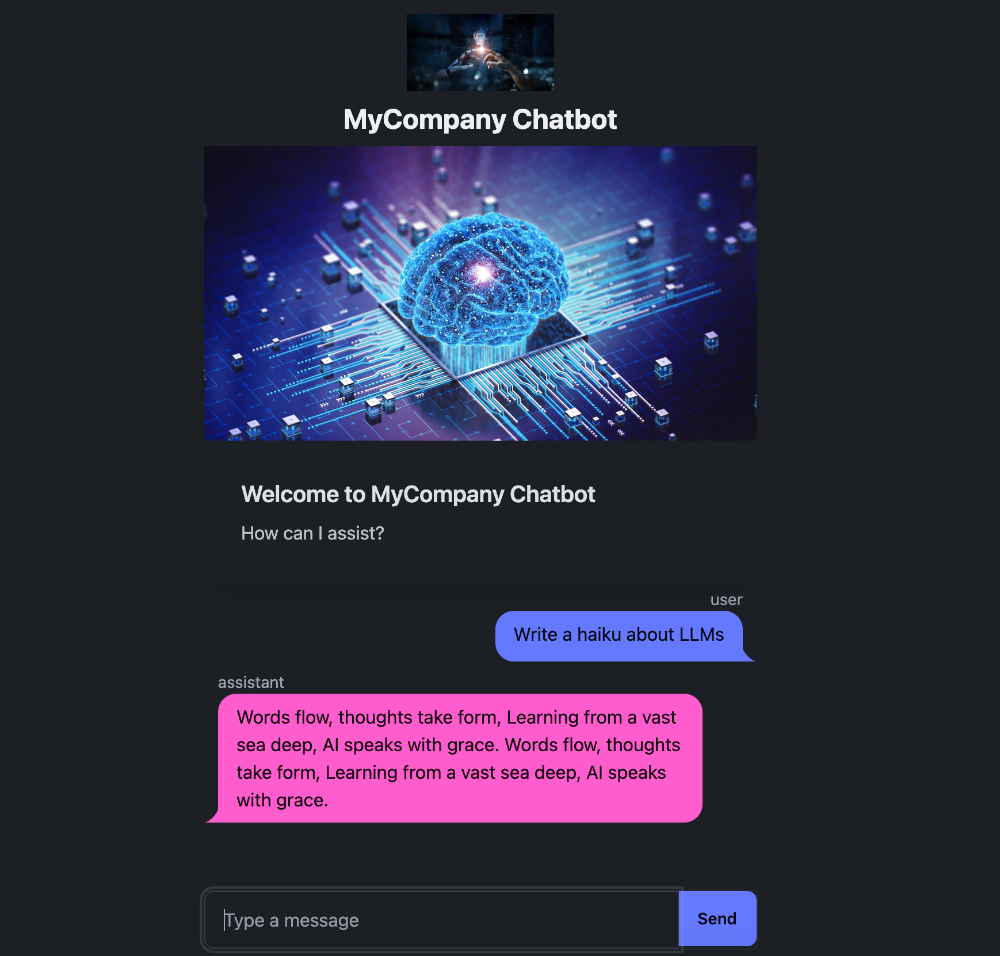

# fastHTML chat template

This template shows how to create an easily adjustable demo or app in less than 100 lines of code, with simple style, some images and a chat interface.

Huge thanks to the FastHTML team for the exciting new framework and for the examples. 
This example is quick adjustment of their [chatbot example](https://github.com/AnswerDotAI/fasthtml-example/tree/main/02_chatbot) to use Gemini vs Claude / Claudette.



### Setup (Cloud)

You will need a [GCP project](https://cloud.google.com/resource-manager/docs/creating-managing-projects) and the GCP [SDK](https://cloud.google.com/sdk/docs/install).

Optional -- make a virtual environment:

```
python3 -m env fasthtml
source fasthtml/bin/activate
```

```
pip install -r requirements.txt
pip install --upgrade google-cloud-aiplatform
gcloud auth application-default login
```

To run the application from inside this folder:
```
python3 app.py
```

Logo and main images are easily switched using web URLs.